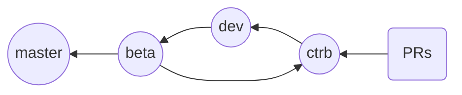

# CONTRIBUTING

When contributing to this repository, please :
 - discuss the changes you wish to make first via [issues](https://github.com/AhmedAyachi/vritra-plugin-notifier/issues).
- stay active when working on a certain issue.

## Conventions To Follow

When you are working with git, please be sure to follow the conventions below on your pull requests, branches and commits:
```
PR: #[ISSUE ID] PR Title
Branch: [ISSUE ID]-pr-title
Last Commit before PR: [ACTION]: changes made
```
Example:
```text
PR: #7 Fix Something
Branch: 7-fix-something (you can make it shorter if it's too long)
Commit: fix: fixing some bug in some component
```

## Branching Philosophy

- ***master*** : Release Branch.
- ***beta*** : Pre-Release Branch.
- ***dev*** : Development Branch.
- ***ctrb*** : PRs target branch

## Notes
- PRs without an issue or with no issue reference in the title will be rejected.
- PRs targeting any branch other than the ***ctrb*** branch will be rejected.
- Make sure to pull the latest version of the upstearm/ctrb branch before you submit a PR.
    ```
    /* add remote */
    git remote add upstream https://github.com/AhmedAyachi/Vritra
    
    /* Update your master */
	git checkout master
	git pull upstream master
	```
- Make sure you code works as expected before submitting a PR.

>A lot of things to consider and it's easy to miss some steps so if it was your first time and your PR was rejected because there was no issue associated with it, simply create the issue and submit a new PR. 

### Thanks for your intention to contribute.